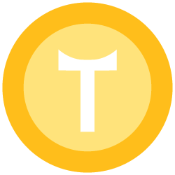

  
  <h1>Welcome to TunCoin!</h1>

<h4>
    <a href="https://tuncoin.io">ICO</a>
   - 
    <a href="https://tuncoin.io/wp/livre-blanc-tuncoin-v1.pdf">WP (FR)</a>
   - 
    <a href="https://tuncoin.io/wp/white_paper_tuncoin_v1.pdf">WP (EN)</a>

 

<!-- Table of Contents -->
# Table of Contents

- [About the Project](#about-the-project)
    * [CONTEXT](#context)
    * [INTRODUCTION](#intro)

<!-- About the Project -->
## About the Project

### CONTEXT

  In recent years, we have seen a rapid expansion of digital currencies.
  At the same time, we cannot deny that the situation of the global economy is fragile.

  The current situation of the world economy has not yet fully recovered from the pandemic. Even before the war, inflation had accelerated in many countries due to supply-demand imbalances and government
  support during the pandemic, which led to a tightening of monetary policy.

  In this context, economic growth will continue to slow and inflation will continue to accelerate. Overall, economic and monetary risks have
  increased significantly.

  The NoMarkUp and TunCoin projects were born in this context, as debanking becomes a major issue for a lot of people among us. 
  On the other hand, E-commerce today does not benefit enough from the advantages that blockchain technology offers.

  We have developed a set of solutions based on blockchain technology and smart-contracts that we will be detailed below.
  We want this white paper to be accessible to beginners in this field, and exhaustive to those who are moe experienced.
  Our goal is simple, to create a system capable of protecting the economic and monetary interests of our users.

### INTRODUCTION
TunCoin is a crypto-currency token based on the Binance Smart Chain (BSC) created by the team for the development of three fully interlocking projects:

1. The issuance of an intuitive digital token to simplify commercial and financial exchanges. With TunCoin anyone is able to access financial services and cheap
capital, and thus generates short-term profits. TunCoin, being decentralized and anonymous, opens up attractive prospects for its holders.
2. The creation of an innovative international Web 3.0 ecommerce corporation based fundamentally on Blockchain technology and smart contracts. NoMarkUp Corporation aims to sell and deliver voted and negotiated products for its customers.
Our nomarkup.shop website will offer a different customer experience, each transaction is driven by a smart contract, at the slightest incident the customer is refunded immediately in full transparency. This is how we tend to innovate the next customer experience.
3. The mission of the NoMarkUp Foundation is to implement and monitor our CSR (Corporate Social Responsibility) strategy, which aims to consider our overall performance from three angles: economic, societal and especially environmental.

We will work with BL-evolution to develop appropriate
actions to make the environmental cause a solid
foundation of our compagny
